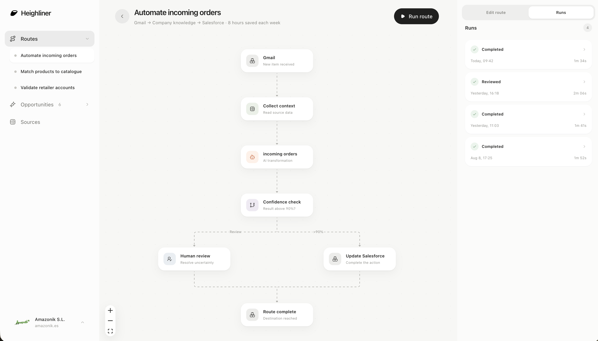

# Heighliner

Heighliner is an AI automation app for companies or personal use.

## How it works

1. **Add your sources.** Attach files such as PDFs, images, text files, and CSVs, or connect tools such as Gmail. Sources give Heighliner context about your company and how work gets done.
2. **Discover opportunities.** Heighliner analyzes your sources and generates practical ideas for work that could be improved or automated.
3. **Create routes.** Turn the opportunities you want to pursue into automated workflows. A route can connect your tools, use company knowledge, apply AI, update other systems, and send uncertain results to a person for review.



## How to use it

1. Install dependencies:

```bash
npm install
```

2. Create your local environment file:

```bash
cp .env.example .env.local
```

3. Add the required keys to `.env.local`:

- `OPENAI_API_KEY` or `ANTHROPIC_API_KEY` for AI generation and file parsing
- `AI_PROVIDER=openai` or `AI_PROVIDER=anthropic` to choose between configured keys
- `COMPOSIO_API_KEY` for integration connections

4. Start the app:

```bash
npm run dev
```

5. Open [http://localhost:3000](http://localhost:3000), create an account, and start a workspace.

Your data is stored locally in `data/heighliner.db`. You own all of it, and it is not sent to any server except the LLM provider you configure for AI generation and file parsing.

## See it in action

Try the demo at [heighliner.janjs.dev](https://heighliner.janjs.dev/)

## Run in production

```bash
npm run build
npm run start
```
